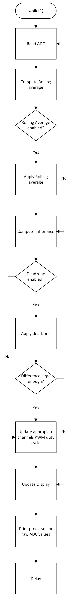
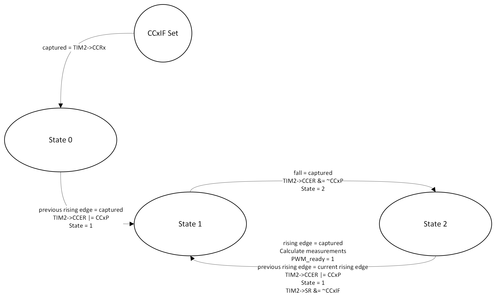
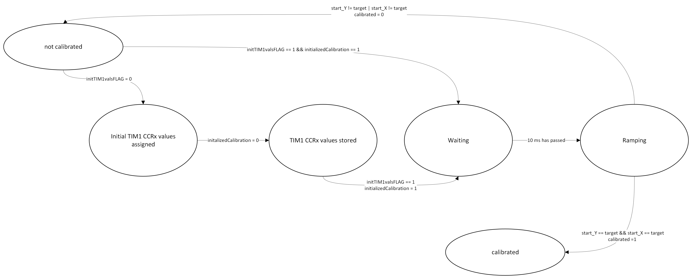
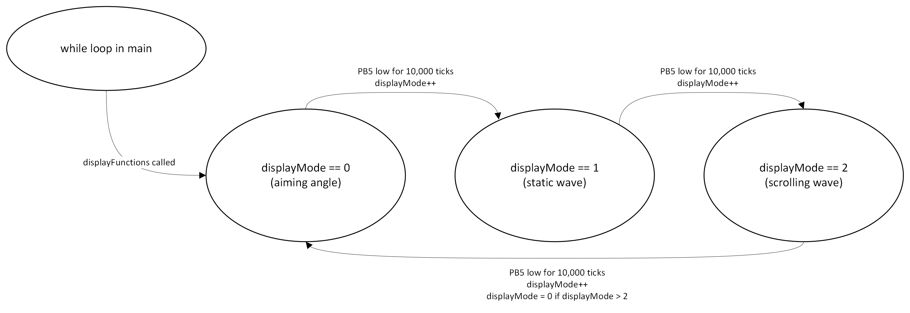

# TurretXY
This project uses two servo motors to create a two-axis turret.  
This is the repository used for the Embedded Systems module's second project at TUD.
## Why this project?
Microcontrollers are commonly used to control multiple motor servos along multiple axes in many industries. Some examples of use cases are in factories where automatic assembly is required, in advanced hospitals for surgical robots, and controlling radar dishes help tune into weak signals. 

## Aim and Objectives

**Aim:**  
The aim of this project is to program an Nucleo-L432KC and build a circuit, that allows for the control of a dual-axes turret. An ST7735 display should be able to see the current angle which each servo is pointing at so that the user can aim it precisely.

**Objectives:**
- To create a circuit that connects two servos to the Nucleo-L432KC and powers them.

- Program the Nucleo-L432KC so that it can control the two servo motors through PWM.

- To use SPI serial communications to send data to an LCD to display the duty percentage, angle of each motor, and to display the PWM wave for easy debugging.

- To use available peripherals where necessary.

- Use Timers to capture inputs to capture PWM signals to use for displaying information on the display.

> A PWM was chosen instead of a DAC as it is the standard way to control servo motors. DMA was not used as there was no way to apply it within the scope of the project.

# Current Features
- Capable of being powered just from the USB connection for uploading as all power is provided from the development board.

- Provides control of two micro servo motors, each capable of approximately 180 degree movement range. 

- Two potentiometers which are read by the ADC (multi-channel mode) and controls the PWM duty percentage for each servo. PWM signal is produced with a period of 50 Hz and the voltage high duration is adjusted between 1 ms and 2.4 ms.

- Rolling average smoothes motor movement and deadzones stop the motors from jittering when still due to noise.

- Servo ramp up ensures that the servos start at their minimum angle of 0 degrees.

- Capable of using an ST7735 display to view duty cycle percentage, aiming angle, and the PWM waveform for both servo motors. PWM highs are shown in green and lows are shown in red for visibility.

- Timers capture both PWM signal's falling and rising edge allowing for information about the PWM signals to be displayed.

- A push button which uses an external interrupt switches between scrolling wave, static wave, and aiming angle display mode.

- UART allows for debugging through the serial monitor using printf(). 

> > Aiming angle mode (default) will display two dials with needles, which represent the angle which each servo motor is currently pointing in.
>
> > Static wave mode will display the PWM signal cropped to only the high portion of the signal so that it is more visible what effect adjusting each potentiometer has.
> 
> > Scolling wave mode will display the PWM signal in an exaggerated form so it is more intuitive (the actual duty cycle percentage is adjustable between 3% and 11% as this is how servos are controlled). The exaggerated form makes it seem like the duty is being adjusted between 10% and 100%. The wave will scroll by and change using updates from the timer capture. 
## Circuit Schematic

> Image of the circuit schematic that was made using KiCAD
#### Required Hardware Components:
- 1x STM32 Nucleo-L432KC
- 1x ST7735 LCD Display
- 2x 20kΩ Potentiometer
- 1x Push Buttons
- 2x Tower Pro Micro Servo 9g (or any servo capable of being powered by 5V)
- 1x 470uF Electrolytic Capacitor
- 2x 0.1uF Ceramic Disc Capacitors
- 2x 10kΩ Resistors

#### Other requirements:
- PlatformIO extension on VSCode
- A serial monitor for debugging (available through PlatformIO extension)

### Pin Config for the L432KC Microcontroller
        
| Pin  |  Peripheral  | Notes |
|:-----|:------------:|:------|
| PA2   | USART2      | Provides UART |
| PA8   | TIM1 Channel 1    | PWM output to servo Y |
| PA9   | TIM1 Channel 2   | PWM output to servo X |
| PB5   | EXTI5    | Toggles between scroll and static mode |
| PA0   | ADC Channel 5      | Converts analogue signal to digital for servo Y |
| PB0   | ADC Channel 15     | Converts analogue signal to digital for servo X |
| PA1   | SCL      | SPI Clock |
| PA4   | CS       | Chip Select |
| PB4   | DC       | Data Control |
| PA6   | RES      | Reset |
| PA7   | SDA      | MOSI data into ST7735 |

## Documentation

### How to Install
1. Clone the repository

        git clone https://github.com/adrianomars/TurretXY.git
        cd TurretXY

2. Open in VSCode
Use the PlatformIO extension to open the project so that it can be uploaded to the board.

3. Check PlatformIO configuration in `platformio.ini` , it should be set to the board that you are using.

4. Build + Upload the code
Building the code will compile the CSMIS and HAL files and uploading to the to the Nucleo-L432KC will make it run.

### How to use the turret
- Once the circuit has been setup as shown in the schematic, it is possible to just upload the code and use the potentiometers to control the servos.
> NOTE: ENSURE THAT WIRES CONNECTING ANY ST7735 PINS ARE AS SHORT AS POSSIBLE DUE TO THE HIGH DATA TRANSFER RATE.
- The program will start by setting up the Nucleo-L432KC, it will display initializing before entering the while loop in main.
- Be careful, as the servos will calibrate to the 90 degree position immediately after initializing. This happens as the the software will reset the TIM1 CCR1 and CCR2 to a safe value and then increment those values until the servos are pointing at 90 degrees. Since there is a 180 degree range of motion, after calibration servos may rotate +90 or -90 degrees.
- Using the potentiometers, each ADC's channel (5 and 15) value can be adjusted between 0 and 4095. Information displayed on the ST7735 will show the motors current angle, duty cycle percentage.
- The first loaded display will be the aiming angle mode. This shows two needles in 2 dials which represent both servos. They will visually show the current angle.
- After pressing the push button, the display will cycle to the next display. After reaching the final display, the display will cycle back to the Aiming Angle display. 
- The static wave display for the PWM outputs to each servo X and Y is the second display. The waveforms show a cropped PWM signal so that the active duty cycle percentage is easy to visualize.
- The scrolling wave display for the PWM outputs to each servo is the third display. The waveforms show an exaggerated PWM signal since thge actual duty cycle percentage at max is 11% but that is hard to see on such a small screen.

### File Structure
There is multiple files used with the main file.

| File  |  Purpose  |
|:-----|:------------|
| main.c   | Contains code for EXTI5. TIM1, TIM2, ADC,  |
| eeng1030_lib.c | Contains code for initializing System Clock, enabling pull-ups, changing pin modes, selecting alternate functions, and delays |
| display.c   | Contains code for driving the ST7735 LCD Display, 2 new functions were added to help with the display. printNumberSHORT() and drawSemiCircle(). |
| spi.c | Contains communication protocol which is used to communicate with the ST7735 display, 1 new function and 1 new variable was added. waitForSPIReady() and ACTIVE_SPI|
| font5x7.h   | Contains the fonts that the display drivers use for writing text and numbers to the ST7735 LCD |

### Diagrams
When designing the system, multiple state machine diagrams and a flowchart were used. This helped to understand how the code would flow and to break problems down into easy to understand diagrams.

#### Main While loop flowchart

  

  

#### TIM2 Input Capture machine state diagram

#### Servo Ramp state machine diagram

#### displayMode machine state diagram

#### 
## Testing and Results

### Testing Procedure
#### Debugger Procedure
The debugger was used to check if bits in registers were being correctly set while the code was running. Every time new code was added, a breakpoint would be set at new code and the debugger would be used to ensure each register would work as expected. 

#### Logic Analyzer Procedure
A logic analyzer was used to test if signals were being sent from each of the PWM outputs correctly. SPI was also tested using this.

The procedure is as follows:
1. Connect the necessary amount of channels from the logic analyzer to the board or peripheral that is being tested. Ensure that the ground channel is connected to ground or the signals will not work.
   > For PWM, 2 channels are needed for ports PA9 and PA8
   >   
   > For SPI, 1 channel is needed for each of the following:  
   > - MOSI (In sigrok pulseview, the non-flash SPI will need either MOSI or MISO but not both)  
   > - MISO  
   > - Chip Select  
   > - SPI Clock
2. Connect the logic analyser to the USB port on a computer which has the sigrok pulseview software on it.
3. Select the appropiate number of samples for the signal being analyzed. (For high frequency signals, it is important to remember the Nyquist-Shannon sampling theorem when sampling the signal as otherwise it will not be accurately displayed in the software.)
4. Select the number of samples to be recorded before ending the recording so that there is enough to store the signal.
5. Select the type of communication protocol or signal modulation that is being analyzed.
6. Run the code on the board if it is not running yet and click run in sigrok pulseview.
7. Analzye the signal using the cursors available to see the timing of signal pulses and use the built-in decoder to read how it interprets each pulse.

> Image showing testing of PWM signal from PA9 during a duty cycle update.

>Image showing the PWM being tested if it stops during a pause state.

> Image showing testing of SPI signal, checking if the 500ms delay is working inbetween refreshes

#### Printf using USART Procedure
The function printf() transmitted serial data through to the serial monitor which was used for debugging. This was used for displaying changes in measured inputs.

The procedure is as follows:
1. The functions to enable and use USART on the board were put into the main file for the code. In the code provided for this project these functions are called initSerial(), _write(), and eputc().
> NOTE: USART2 uses PA2 for transmitting information. There are other ports which can send 
2. Choose the variable which is suspected to be not updating correctly in the code
3. Go to main and create a while loop which uses printf() to print the variable (repeat this print multiple times if necessary to show iterative updates and use delays to make it more readable).
4. Go to the serial monitor and watch as the code runs. If needed this can be done in conjunction with the debugger.

        // Print ADC values
        printf("Pot1: %u | Pot2: %u\n", pot1_avg, pot2_avg);
        delay_ms(50); // Small delay for readability
  
> This is the code used for printing the ADC processed/unprocessed readings

### Results
#### Dual channel ADC initialization and readings
To test that the dual channel ADC initialized, the debugger was used to check that each register was configured correctly. Testing the ADC readings involved printing the ADC values to the serial monitor.

##### ADC Registers after initADC()  
  - 

  

  - 

  CCIPR">

  - 

  

  - ADC1->CR:

  

  - ADC1->CFGR:

  CFGR">

##### Testing readADC_All
  - ADC Readings from potentiometers both maximum value:

  

  - ADC Readings from potentiometers both at lowest value:

  ISR">

To remove noise at the potentiometers, two 10,000 ohm resistors were connected in parallel to the wire connecting to the pins the ADC was reading from and connected to ground. This removed noise and allowed for a consistent minimum value of 0 from the ADC.

  - ADC Readings from potentiometers with one at half-maximum value and the other at max:

  
  

Cross-talk was initially an issue due to residual charge creating noise in the ADC when switching between channel 5 and channel 15. To solve this, first the ADC's sampling time was configured in the registers to to be longer so that the charge could dissipate but this only mitigated the problem slightly. To solve this issue completely, a 100nF ceramic disc capacitor was used to let the charge disipate quickly to the ground pin.

#### Testing if EXTI5 does increment the displayMode counter variable.

  

  

  

  

  

  

The test was successful and after incrementing past two the displayMode successfully return to displayMode = 0.

#### ST7735 Display
To test if the display worked, the display itself was used along with the debugger and logic analyzer.

        void initSPI(SPI_TypeDef *spi)
        {
        	/*	I/O List
        		PA7  : SPI1 MOSI : Alternative function 5		
                PA6  : Reset     : GPIO
                PA11 : SPI1 MISO : Alternative function 5		
        		PA5  : SPI1 SCLK : Alternative function 5    
                PA4  : CS        : GPIO
        */
        	int drain;	
            RCC->APB2ENR |= (1 << 12); // turn on SPI1
        	// Now configure the SPI interface        
            pinMode(GPIOA,7,2);        
            pinMode(GPIOA,1,2); //CHANGED BACK TO 1
            pinMode(GPIOA,11,2);
            selectAlternateFunction(GPIOA,7,5);        
            selectAlternateFunction(GPIOA,1,5); // CHANGED BACK TO 1
            selectAlternateFunction(GPIOA,11,5);
        
        	drain = spi->SR;				// dummy read of SR to clear MODF	
        	// enable SSM, set SSI, enable SPI, PCLK/2, MSB First Master, Clock = 1 when idle, CPOL=1 (SPI mode 3 overall)   
        	spi->CR1 = (1 << 9)+(1 << 8)+(1 << 6)+(1 << 2) +(1 << 1) + (1 << 0)+(1 << 3); // Assuming 80MHz default system clock set SPI speed to 20MHz 
        	spi->CR2 = (1 << 10)+(1 << 9)+(1 << 8); 	// configure for 8 bit operation
        }

> Code block containing the initSPI function used in the code

##### Using the debugger to test if SPI was initalizing correctly:
  - RCC->APB2ENR:

  

 
  
  - pinMode(GPIOA,X,2):

  

 
  
  - alternateFunction(GPIOA,X,5)

  

 
  
  - drain = spi->SR

  

 
  
  - spi->CR1:

  

 
  
  - spi->CR2:

  

 

##### Using the Logic analyzer to ensure that data was being sent through the SDA (MOSI) pin of the ST7735 LCD Display
These are all from the same logic analyzer recording 

  
  
  

  

From this it can be seen that data was being sent through the SDA pin on the ST7735 LCD display to update it

## Conclusion

## Video Demo of the Project
This video shows a demonstration of all of the features working in the project as of 22/03/2025

  

