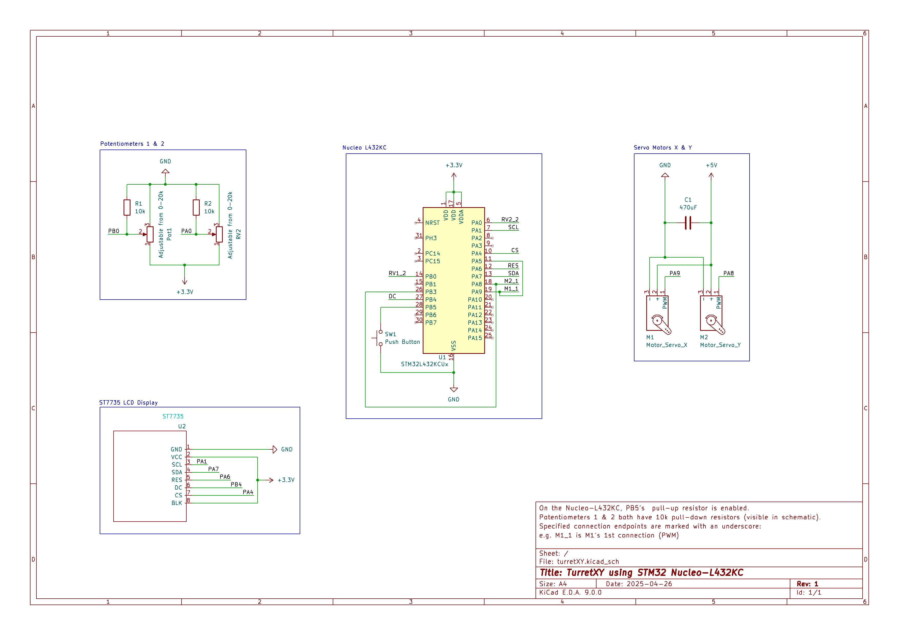

# TurretXY
This project uses two servo motors to create a two-axis turret.  
This is the repository used for the Embedded Systems module's second project at TUD.
## Why this project?
Microcontrollers are commonly used to control multiple motor servos along multiple axes in many industries. Some examples of use cases are in factories where automatic assembly is required, in advanced hospitals for surgical robots, and controlling radar dishes help tune into weak signals. 

## Aim and Objectives

**Aim:**  
The aim of this project is to program an Nucleo-L432KC and build a circuit, that allows for the control of a dual-axes turret. An ST7735 display should be able to see the current angle which each servo is pointing at so that the user can aim it precisely.

**Objectives:**
- To create a circuit that connects two servos to the Nucleo-L432KC and powers them.

- Program the Nucleo-L432KC so that it can control the two servo motors through PWM.

- To use SPI serial communications to send data to an LCD to display the duty percentage, angle of each motor, and to display the PWM wave for easy debugging.

- To use available peripherals where necessary.

- Use Timers to capture inputs to capture PWM signals to use for displaying information on the display.

> A PWM was chosen instead of a DAC as it is the standard way to control servo motors. DMA was not used as there was no way to apply it within the scope of the project.

# Current Features
- Capable of being powered just from the USB connection for uploading as all power is provided from the development board.

- Provides control of two micro servo motors, each capable of approximately 180 degree movement range. 

- Two potentiometers which are read by the ADC (multi-channel mode) and controls the PWM duty percentage for each servo. PWM signal is produced with a period of 50 Hz and the voltage high duration is adjusted between 1 ms and 2.4 ms.

- Rolling average smoothes motor movement and deadzones stop the motors from jittering when still due to noise.

- Servo ramp up ensures that the servos start at their minimum angle of 0 degrees.

- Capable of using an ST7735 display to view duty cycle percentage, aiming angle, and the PWM waveform for both servo motors. PWM highs are shown in green and lows are shown in red for visibility.

- Timers capture both PWM signal's falling and rising edge allowing for information about the PWM signals to be displayed.

- A push button which uses an external interrupt switches between scrolling wave, static wave, and aiming angle display mode.

- UART allows for debugging through the serial monitor using printf(). 

> > Aiming angle mode (default) will display two dials with needles, which represent the angle which each servo motor is currently pointing in.
>
> > Static wave mode will display the PWM signal cropped to only the high portion of the signal so that it is more visible what effect adjusting each potentiometer has.
> 
> > Scolling wave mode will display the PWM signal in an exaggerated form so it is more intuitive (the actual duty cycle percentage is adjustable between 3% and 11% as this is how servos are controlled). The exaggerated form makes it seem like the duty is being adjusted between 10% and 100%. The wave will scroll by and change using updates from the timer capture. 
## Circuit Schematic

> Image of the circuit schematic that was made using KiCAD
#### Required Hardware Components:
- 1x STM32 Nucleo-L432KC
- 1x ST7735 LCD Display
- 2x 20kΩ Potentiometer
- 1x Push Buttons
- 2x Tower Pro Micro Servo 9g (or any servo capable of being powered by 5V)
- 1x 470uF Electrolytic Capacitor 
- 2x 10kΩ Resistors

#### Other requirements:
- PlatformIO extension on VSCode
- A serial monitor for debugging (available through PlatformIO extension)

### Pin Config for the L432KC Microcontroller
        
| Pin  |  Peripheral  | Notes |
|:-----|:------------:|:------|
| PA2   | USART2      | Provides UART |
| PA8   | TIM1 Channel 1    | PWM output to servo Y |
| PA9   | TIM1 Channel 2   | PWM output to servo X |
| PB5   | EXTI5    | Toggles between scroll and static mode |
| PA0   | ADC Channel 5      | Converts analogue signal to digital for servo Y |
| PB0   | ADC Channel 15     | Converts analogue signal to digital for servo X |
| PA1   | SCL      | SPI Clock |
| PA4   | CS       | Chip Select |
| PB4   | DC       | Data Control |
| PA6   | RES      | Reset |
| PA7   | SDA      | MOSI data into ST7735 |

## Documentation

### How to Install
1. Clone the repository

        git clone https://github.com/adrianomars/TurretXY.git
        cd TurretXY

2. Open in VSCode
Use the PlatformIO extension to open the project so that it can be uploaded to the board.

3. Check PlatformIO configuration in `platformio.ini` , it should be set to the board that you are using.

4. Build + Upload the code
Building the code will compile the CSMIS and HAL files and uploading to the to the Nucleo-L432KC will make it run.

### How to use the turret
- Once the circuit has been setup as shown in the schematic, it is possible to just upload the code and use the potentiometers to control the servos.
> NOTE: ENSURE THAT WIRES CONNECTING ANY ST7735 PINS ARE AS SHORT AS POSSIBLE DUE TO THE HIGH DATA TRANSFER RATE.
- The program will start by setting up the Nucleo-L432KC, it will display initializing before entering the while loop in main.
- Be careful, as the servos will calibrate to the 90 degree position immediately after initializing. This happens as the the software will reset the TIM1 CCR1 and CCR2 to a safe value and then increment those values until the servos are pointing at 90 degrees. Since there is a 180 degree range of motion, after calibration servos may rotate +90 or -90 degrees.
- Using the potentiometers, each ADC's channel (5 and 15) value can be adjusted between 0 and 4095. Information displayed on the ST7735 will show the motors current angle, duty cycle percentage.
- The first loaded display will be the aiming angle mode. This shows two needles in 2 dials which represent both servos. They will visually show the current angle.
- After pressing the push button, the display will cycle to the next display. After reaching the final display, the display will cycle back to the Aiming Angle display. 
- The static wave display for the PWM outputs to each servo X and Y is the second display. The waveforms show a cropped PWM signal so that the active duty cycle percentage is easy to visualize.
- The scrolling wave display for the PWM outputs to each servo is the third display. The waveforms show an exaggerated PWM signal since thge actual duty cycle percentage at max is 11% but that is hard to see on such a small screen.

### Structure
There is multiple files used with the main file.

| File  |  Purpose  |
|:-----|:------------|
| main.c   | Contains code for EXTI5. TIM1, TIM2, ADC,  |
| eeng1030_lib.c | Contains code for initializing System Clock, enabling pull-ups, changing pin modes, selecting alternate functions, and delays |
| display.c   | Contains code for driving the ST7735 LCD Display, 2 new functions were added to help with the display. printNumberSHORT() and drawSemiCircle(). |
| spi.c | Contains communication protocol which is used to communicate with the ST7735 display, 1 new function and 1 new variable was added. waitForSPIReady() and ACTIVE_SPI|
| font5x7.h   | Contains the fonts that the display drivers use for writing text and numbers to the ST7735 LCD |

## Testing and Results

### Testing Procedure
#### Debugger Procedure
The debugger was used to check if bits in registers were being correctly set while the code was running. Every time new code was added, a breakpoint would be set at that code and the debugger would be run until it got to that breakpoint where each register would then be inspected to make sure that they were being set and cleared as expected. 

#### Logic Analyzer Procedure
A logic analyzer was used during this project to test if signals were being sent to each of the boards peripherals correctly. This is extremely useful since there is not many ways to debug or test problems with board peripheral outputs such as SPI or PWM without using this or an oscilloscope which is much more expensive.

The procedure is as follows:
1. Connect the necessary amount of channels from the logic analyzer to the board or peripheral that is being tested. Ensure that the ground channel is connected to ground or the signals will not work.
   > For PWM, 2 channels are needed for ports PA9 and PA8
   >   
   > For SPI, 1 channel is needed for each of the following:  
   > - MOSI (In sigrok pulseview, the non-flash SPI will need either MOSI or MISO but not both)  
   > - MISO  
   > - Chip Select  
   > - SPI Clock
2. Connect the logic analyser to the USB port on a computer which has the sigrok pulseview software on it.
3. Select the appropiate number of samples for the signal being analyzed. (For high frequency signals, it is important to remember the Nyquist-Shannon sampling theorem when sampling the signal as otherwise it will not be accurately displayed in the software.)
4. Select the number of samples to be recorded before ending the recording so that there is enough to store the signal.
5. Select the type of communication protocol or signal modulation that is being analyzed.
6. Run the code on the board if it is not running yet and click run in sigrok pulseview.
7. Analzye the signal using the cursors available to see the timing of signal pulses and use the built-in decoder to read how it interprets each pulse.

> Image showing testing of PWM signal from PA9 during a duty cycle update.

>Image showing the PWM being tested if it stops during a pause state.

> Image showing testing of SPI signal, checking if the 500ms delay is working inbetween refreshes

#### Printf using USART Procedure
For debugging it was useful to use printf(), as it prints values from variables which allows for debugging and testing for any peripheral or function that stores a value that is meant to change. It was used to ensure the ADC values changed correctly when adjusting the potentiometers. 

The procedure is as follows:
1. The functions to enable and use USART on the board were put into the main file for the code. In the code provided for this project these functions are called initSerial(), _write(), and eputc().
> NOTE: USART2 uses PA2 for transmitting information. There are other ports which can send 
2. Choose the variable which is suspected to be not updating correctly in the code
3. Go to main and create a while loop which uses printf() to print the variable (repeat this print multiple times if necessary to show iterative updates and use delays to make it more readable).
4. Go to the serial monitor and watch as the code runs. If needed this can be done in conjunction with the debugger.

              // Print milliseconds through serial for debugging SysTick (uncomment to use)
              printf("%ld \n",milliseconds);
  
> This is the code used for printing the milliseconds variable

> Image shows printf() printing the value of the variable milliseconds while program is running

### Results
#### Adjusting Duty Cycle using a potentiometer and an ADC
To test if adjusting the duty cycle was working, the ADC registers were confirmed to work through the debugger and printf() was used to display the ADC value.
The two ADC functions have both been listed here so that it can be seen what the register values are supposed to be.

        void initADC()
        {
            // Initialize the ADC
            RCC->AHB2ENR |= (1 << 13); // Enable the ADC
            RCC->CCIPR |= (1 << 29) | (1 << 28); // Select system clock for ADC
            ADC1_COMMON->CCR = ((0b01) << 16) + (1 << 22) ; // Set ADC clock = HCLK and turn on the voltage reference
            // Start ADC calibration    
            ADC1->CR=(1 << 28); // Turn on the ADC voltage regulator and disable the ADC
            delay_ms(100); // Wait for voltage regulator to stabilize (20 microseconds according to the datasheet).  This gives about 180microseconds
            ADC1->CR |= (1<< 31);
            while(ADC1->CR & (1 << 31)); // Wait for calibration to finish.
            ADC1->CFGR = (1 << 31); // Disable injection
            ADC1_COMMON->CCR |= (0x0f << 18);
        }
        
        int readADC(int chan)
        {
            ADC1->SQR1 |= (chan << 6); // Set channel
            ADC1->ISR = (1 << 3); // Clear EOS flag
            ADC1->CR |= (1 << 0); // Enable the ADC
            while ( (ADC1->ISR & (1 <<0))==0); // Wait for ADC to be ready
            ADC1->CR |= (1 << 2); // Start conversion
            while ( (ADC1->ISR & (1 <<3))==0); // Wait for conversion to finish
            return ADC1->DR; // Return the result
            ADC1->CR = 0;
        }

> This code block shows the two ADC functions

##### ADC Registers after initADC()  
  - RCC->AHB2ENR:

  AHB2ENR">

  - RCC->CCIPR:

  CCIPR">

  - ADC1_COMMON->CCR:

  CCR">

  - ADC1->CR:

  CR">

  - ADC1->CFGR:

  CFGR">

##### ADC Registers after using readADC() function  
  - ADC1->SQR1:

  SQR1">

  - ADC1->ISR:

  ISR">

  - ADC1->CR:

  CR">

  - ADC1->CFGR:

  CFGR">

  - ADC1_COMMON->CCR:

  CCR">

  

##### Using printf() to display the ADC value in the serial monitor:  
  For testing with printf() and the serial monitor from PlatformIO, the potentiometer was slowly adjusted slowly to see if each value would be read and converted correctly as 0-3.3V was converted into a digital unit between 0-4095.
  
        //printf("%ld \n", readADC(5));
  
  > The code used to print the ADC value in the while loop  

  

  

> Image of printed ADC values while adjusting the potentiometer

#### Checking if the set current duty cycle button sets updateDutyCycle flag.
To check if setting the current duty cycle sets the updateDutyCycle flag through EXTI5 when the button connected to PB5 was pressed, the debugger was used.

- Before pressing the button connected to PB5  

        // EXTI5 Interrupt Handler (Adjust Duty Cycle Button)
        void EXTI9_5_IRQHandler(void)
        {
            if ((GPIOB->IDR & (1 << 5)) == 0) {  // Check if button is pressed
                delay(10000);  // Debounce delay
                if ((GPIOB->IDR & (1 << 5)) == 0) {  // Confirm stable press
                    updateDutyCycle=1; // Set update duty cycle flag so interrupt is quick
                }
            }
            EXTI->PR1 |= (1 << 5);  // Clear EXTI5 interrupt flag
        }
  > The code for the adjust duty cycle button interrupt   

  

  

  > Image showing the updateDutyCycle flag in the debugger before pressing button connected to PB5

- After pressing the button:  

            if(updateDutyCycle==1) // Updating Duty Cycle
            {
                stepVal[dutyAdjust_Idx] = readADC(5); // Insert current ADC value into array
                dutyAdjust_Idx=(dutyAdjust_Idx+1)%NUM_STEPS; // Incremement dutyAdjust Idx by one in modulo 4
                updateDutyCycle = 0; // Reset update duty cycle flag
            }
> The code in main for updating the duty cycle after the flag had been set

  

  

> Image showing the updateDutyCycle flag in the debugger after pressing the button connected to PB5

- After the steps duty cycle was set:

  

  

> Image showing the updateDutyCycle flag being reset to 0 after updating the duty for the step

#### Playing Steps in Sequence in 1 second Intervals
Each step in the sequence shown below in the array variable was intended to last for 1 second before incrementing to the next step. 

        volatile uint32_t stepVal[NUM_STEPS] = {4000,2000,0,2000,4000,2000,0,2000};  // Duty Cycle array
        
Using the logic analyzer this was tested.
> Note that the sequencer was initally start on the second step in the array so the last step in the full sequence is actually the first step.  

##### Testing each Step through Logic Analyzer
- Full Sequence
  
  
- Step 1:
  
  
  Step 1 Duty Cycle:
  

- Step 2:
  
  
  Step 2 Duty Cycle:
  

- Step 3:  
  This is a step that was set to be off (0) and this can be seen in the full sequence above as the first section of the full sequence with no changes from 0 to 1 or 1 to 0, it was 1 second long.
  
- Step 4:
  
  
  Step 4 Duty Cycle:
  

- Step 5:
  
  
  Step 5 Duty Cycle:
  

- Step 6:
  
  
  Step 6 Duty Cycle:
  

- Step 7:  
  This is a step that was set to be off (0) and this can be seen in the full sequence above as the second section of the full sequence with no changes from 0 to 1 or 1 to 0, it was 1 second long.

- Step 8:
  
  
  Step 8 Duty Cycle:
  

The time interval inbetween steps was found to be approximately 1 second long (there was small variations) and each step was shown to be played in the seqeunce, however the sequencer played from the second step instead of the first, however this was not considered a major issue as the seqeuncer was intended to loop anyway.

#### Pausing the Sequencer
To test if pausing worked, the register for the LED on port PB3 was looked at using the debugger and printf() was used to check if SysTick stopped incrementing the milliseconds variable. The logic analyzer was also used to to see if the PWM signal was stopped during the pause state since PWM is a setting from TIM1.

            if(pauseState == 0) // If not paused
            {
                TIM1->CR1 |= (1<<0); // Enable TIM1
                fillRectangle(4, 50, 100, 40, RGBToWord(0, 0, 0));  // Clear pause text
            }
            else if(pauseState == 1) //if paused
            {
                TIM1->CR1 &= ~(1<<0); // Disable TIM1
                printTextX2("PAUSED", 4, 60, RGBToWord(255, 255, 255), RGBToWord(0, 0, 0));
            }
> Code in main to be used with the pauseState flag

        // EXTI4 Interrupt Handler (Pause Button)
        void EXTI4_IRQHandler() 
        {
            if ((GPIOB->IDR & (1 << 4)) == 0) {  // Check if button is pressed
                delay(10000);  // Debounce delay
                if ((GPIOB->IDR & (1 << 4)) == 0) {  // Confirm stable press
                    pauseState = !pauseState;  // Toggle pause state
                    GPIOB->ODR ^= (1 << 3);  // Toggle Red Pause LED (PB3)
                }
            }
            EXTI->PR1 |= (1 << 4);  // Clear EXTI4 interrupt flag
        }

> EXTI4 interrupt handler code used when PB4 button is pressed

##### Port PB3 Register and EXTI4 pauseState flag
- Before pressing the button connected to PB4
  - GPIOB->ODR and TIM1->CR1:

  
  

> Image showing the GPIOB->ODR and TIM1->CR1 registers before setting the pauseState flag

  

 

> Image showing the pauseState flag at 0

- After pressing the button connected to PB4
  - GPIOB->ODR and TIM1->CR1:
    

  
  

 

> Image showing the GPIOB->ODR and TIM1->CR1 registers after setting pauseState flag

  

 

> Image showing the pauseState flag at 1

Since the register for PB3 is set, the LED is on

- After pressing the button connected to PB4 again (leave pause state)
  - GPIOB-> ODR and TIM1->CR1:

  
  

 

> Image showing the GPIOB->ODR and TIM1->CR1 registers after clearing the pauseState flag

  

 

> Image showing the pauseState flag at 0 again

##### Using printf() for tickcntr variable to show behaviour during pause state
  

  

 

> Image showing that tickcntr has successfully been paused and is not incrementing while the pauseState flag is set. It can be seen that 564 is printed multiple times as it does not increment.

##### Logic analyzer showing PWM during pause state
Two step pauses were tested using the logic analyzer with one being less than a second and the other being multiple seconds
- Pausing and unpausing in the same step (full 4000 value)
  - Step before the pause
    

  - Step continued after the pause
    
    
- Pausing and unpausing as another step begins
  - Step before the pause
    

  - Step after the pause
    

    The pause state seemed to cause the step to last less time than its intended 1 second duration when paused and unpaused in the same step. 
    Pausing before going to the next step does not seem to be as impactful but still causes a minor loss in the steps duration.
    Both of these effects are likely due to the delay in the EXTI4 handler as the delay is 10000 ticks long which may be causing the external interrupt to use up between 100-200 ms of the steps duration before the interrupt flag is actually cleared.

#### ST7735 Display
To test if the display worked, the display itself was used along with the debugger and logic analyzer.

        void initSPI(SPI_TypeDef *spi)
        {
        	/*	I/O List
        		PA7  : SPI1 MOSI : Alternative function 5		
                PA6  : Reset     : GPIO
                PA11 : SPI1 MISO : Alternative function 5		
        		PA5  : SPI1 SCLK : Alternative function 5    
                PA4  : CS        : GPIO
        */
        	int drain;	
            RCC->APB2ENR |= (1 << 12); // turn on SPI1
        	// Now configure the SPI interface        
            pinMode(GPIOA,7,2);        
            pinMode(GPIOA,1,2); //CHANGED BACK TO 1
            pinMode(GPIOA,11,2);
            selectAlternateFunction(GPIOA,7,5);        
            selectAlternateFunction(GPIOA,1,5); // CHANGED BACK TO 1
            selectAlternateFunction(GPIOA,11,5);
        
        	drain = spi->SR;				// dummy read of SR to clear MODF	
        	// enable SSM, set SSI, enable SPI, PCLK/2, MSB First Master, Clock = 1 when idle, CPOL=1 (SPI mode 3 overall)   
        	spi->CR1 = (1 << 9)+(1 << 8)+(1 << 6)+(1 << 2) +(1 << 1) + (1 << 0)+(1 << 3); // Assuming 80MHz default system clock set SPI speed to 20MHz 
        	spi->CR2 = (1 << 10)+(1 << 9)+(1 << 8); 	// configure for 8 bit operation
        }

> Code block containing the initSPI function used in the code

##### Using the debugger to test if SPI was initalizing correctly:
  - RCC->APB2ENR:

  

 
  
  - pinMode(GPIOA,X,2):

  

 
  
  - alternateFunction(GPIOA,X,5)

  

 
  
  - drain = spi->SR

  

 
  
  - spi->CR1:

  

 
  
  - spi->CR2:

  

 

##### Using the Logic analyzer to ensure that data was being sent through the SDA (MOSI) pin of the ST7735 LCD Display
These are all from the same logic analyzer recording over 40 seconds  

  
  
  

  

From this it can be seen that data was being sent through the SDA pin on the ST7735 LCD display to update it

## Conclusion
The 8-step sequencer met all of the main objectives of the project except for allowing a MIDI connection to transmit to and from the board which was not possible due to time constraints. All other objectives were met and using the board and components with the provided code provides the a basic 8-step sequencer with ST7735 display support. Some improvments could be made to the accuracy of timing for the step intervals and future work for this could be to implement the MIDI connection and to allow for the timing of the step interval to also be adjusted. Overall, the project was a success. 

## Video Demo of the Project
This video shows a demonstration of all of the features working in the project as of 22/03/2025

  

